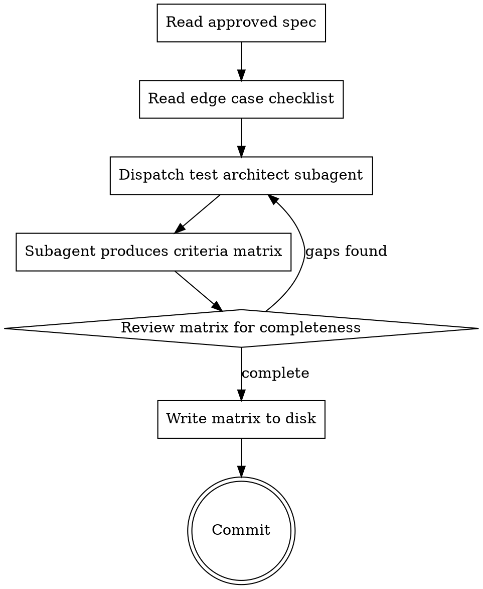

# Criteria Extraction

Read an approved spec and produce a machine-parseable criteria matrix —
the testable contract that the implementation, verification, and review
phases all verify against.

## When to Use

After the spec is written and approved (via superpowers:brainstorming),
before writing the implementation plan. This is the bridge between
"what we're building" and "how we know it's built correctly."

## Process



### Step 1: Read inputs

1. Read the approved spec doc (path provided by caller or found in
   the project's spec directory)
2. Read `references/edge-case-checklist.md`

### Step 2: Dispatch test architect

Dispatch a subagent using the prompt template at
`references/test-architect-prompt.md`. Provide:
- The full spec content
- The full edge case checklist content
- The spec file path (for the `source_spec` field in output)

Use `model: "opus"` — criteria extraction requires adversarial thinking
and thoroughness, not speed.

### Step 3: Review the matrix

After the subagent returns, check:
- Every section/feature in the spec has at least one REQ entry
- Every REQ has at least one edge case
- Edge case descriptions are specific (not vague)
- SUMMARY counts match actual entries
- No proof types reference `visual` or `visual-flow` for non-UI features

If gaps exist, re-dispatch the subagent with specific instructions about
what was missed.

### Step 4: Write and commit

Write the criteria matrix to the same directory as the spec:
`<spec-dir>/YYYY-MM-DD-<topic>-criteria-matrix.md`

Commit with message: `Add criteria matrix for <topic>`

### Step 5: Report to caller

Print the summary:
```
[criteria-extraction] Matrix written to <path>
  Requirements: N
  Edge cases: N
  Proof types: N test-only, N visual, N visual-flow, N manual
```

## Rules

- **Never invent requirements.** The matrix tests what the spec says.
  Scope expansion belongs in the spec, not here.
- **Never skip the edge case checklist.** Every category must be
  evaluated against every requirement. Over-generation is acceptable;
  under-generation is not.
- **Fresh eyes only.** The test architect subagent must NOT receive
  the conversation history. It reads the spec cold, like an external
  QA engineer.
- **One matrix per spec.** If the spec covers multiple independent
  subsystems, it should have been split during brainstorming. If it
  wasn't, flag this and suggest splitting.
