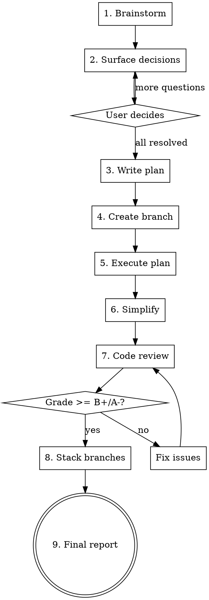

# Hey Bud — End-to-End Feature Builder

Build a feature from idea to merge-ready code in one session. Brainstorm, surface decisions for the user, implement, review until quality gate passes, clean up, stack branches with Graphite.

## Process



## Phase Details

### 1. Brainstorm

**Invoke:** `superpowers:brainstorming`

Follow the full brainstorming flow — explore context, ask clarifying questions one at a time, propose 2-3 approaches, present design, write spec. Offer visual companion if UI work is involved.

### 2. Surface Decisions

After the spec is written but BEFORE writing the plan, extract every point where the user might have a strong opinion. Present them as a numbered list with your recommendation for each.

**What to surface:**
- Tradeoffs with no obvious winner (sync vs async, reset schedule vs not)
- Behavior under edge cases (what happens when X is deleted/missing?)
- UX choices (button placement, wording, error messages)
- Scope boundaries (include this adjacent thing or save for later?)
- Anything where two reasonable engineers would disagree

**Format:**
> Here are the decisions I'd like your input on:
>
> 1. **[Decision]** — [options]. I'd lean [X] because [reason].
> 2. **[Decision]** — [options]. Thoughts?
>
> Everything else is implementation detail. Which of these do you want to weigh in on?

Keep asking until the user confirms all decisions are resolved. Update the spec with their answers.

### 3. Write Plan

**Invoke:** `superpowers:writing-plans`

Create the implementation plan from the finalized spec. Include plan review loop.

### 4. Create Branch

Create a feature branch BEFORE executing. Ask the user for the branch name or suggest one based on the feature. Do NOT commit to master.

### 5. Execute Plan

**Invoke:** `superpowers:subagent-driven-development`

Execute task-by-task with fresh subagents and two-stage review (spec compliance + code quality) per task.

### 6. Simplify

**Invoke:** `simplify` skill

Review all changed code for reuse opportunities, quality issues, and efficiency. Fix anything found.

### 7. Code Review Loop

Dispatch the `code-reviewer` agent on the full implementation. The review must grade the work.

**Quality gate: B+/A- or higher.**

If grade is below B+/A-:
1. Read the review findings
2. Fix every issue flagged as critical or important
3. Re-run the code-reviewer agent
4. Repeat until grade meets the gate

Track what was fixed in each iteration for the final report.

### 8. Stack Branches with Graphite

After the quality gate passes, help the user organize commits into a clean PR stack using Graphite (`gt` CLI).

**Approach:**
1. Review the commit history on the branch (`git log --oneline`)
2. Propose a stacking strategy — group commits into logical PRs that can be reviewed independently. Good split boundaries:
   - Backend model/logic changes (reviewable without frontend)
   - Backend API changes + tests
   - Frontend changes + tests
   - Each independent feature if the branch has multiple
3. Present the proposed stack to the user for approval:
   > I'd split this into N stacked PRs:
   >
   > 1. **PR title** — commits X, Y (description)
   > 2. **PR title** — commits Z (description)
   >
   > Does this split make sense?
4. Once approved, execute the stacking:
   - Use `gt create` to create each branch in the stack
   - Use `gt submit` to create the PRs
   - Follow the repo's PR template (read `.github/pull_request_template.md`)

**If the user prefers a single PR:** Skip stacking, just use `gt create` + `gt submit` for the whole branch.

**If unfamiliar with the repo's Graphite setup:** Ask the user how they typically stack before assuming.

#### Public-OSS PR body safety

Before running `gt submit` (or `gh pr create`/`edit`), check the PR body for things that must NEVER ship in a public repo:

- **No internal operational metrics.** Don't cite team counts, event counts, percentages of failure rates, latency p99s, customer-specific numbers, or "we observed X / Y / Z" stats. Even when those numbers came from a tool the user ran (slo-failures-daily, internal dashboards, prod queries), they don't belong in a public PR description. Summarise at a high level — "polluting the SLO failure-rate signal" instead of "211 events / 7 days from 34 teams".
- **No customer or incident references.** No customer names, no internal Slack thread references, no specific incident IDs.
- **No unreleased roadmap details** that aren't already public.
- **Verify claims against the actual diff.** PR bodies drift mid-iteration — the description gets ahead of the code as you simplify or revert. Before submit, cross-check named functions, file paths, behaviour claims against the actual diff at the branch tip.
- **Match `.github/pull_request_template.md` structure** but treat its sections as guardrails for what to include, not a license to dump everything you know.

This is enforced by `AGENTS.md` lines 70-77 in the PostHog repo. Public OSS = pretend a contributor with zero internal context is reading. If a sentence wouldn't make sense to them or relies on private knowledge, cut it.

### 9. Final Report

When everything is ready, present:

```
## Feature Complete

**Branch:** [branch name]
**Grade:** [final grade]
**PRs:** [links to stacked PRs, or "ready to submit"]

### What was built
- [bullet summary of each feature/change]

### Design decisions made
- [each decision from phase 2 + what was chosen + why]

### Issues found and fixed during review
- [iteration 1: what was caught, what was fixed]
- [iteration 2: ...]

### Files changed
- [grouped by area: backend, frontend, tests]

### Test results
- [backend: X passed]
- [frontend: X passed]
```

## Rules

- **Never commit to master.** Always create a branch first.
- **Never push** unless the user explicitly asks.
- **Never skip the decision surfacing phase.** Even if you think everything is obvious, present at least the top 3 decisions.
- **Never skip simplify.** Run it even if you think the code is clean.
- **Never accept below B+/A-.** Keep looping.
- **Track everything.** The final report must include all design decisions and all review fixes. The user needs to know what tradeoffs were made on their behalf.
- **Always propose the branch stack** before executing it. Let the user adjust the split.
