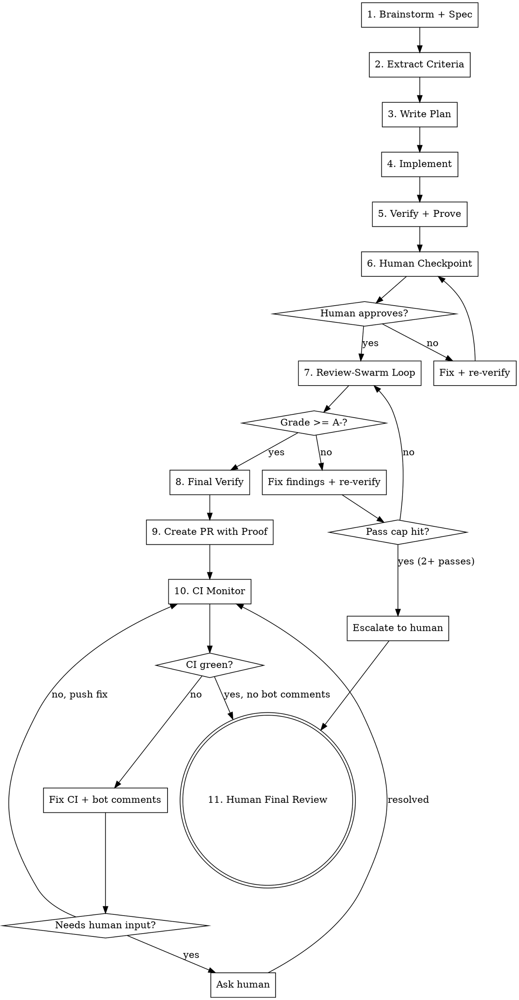

# Proof-Driven Development

Build a feature from idea to merge-ready PR with full proof of work.
Every requirement traced from spec to criteria to tests to verification
report to PR.

## Pipeline Modes

The pipeline has two modes. Pick the right one — the full pipeline on a
5-line bugfix wastes time, and lightweight mode on a complex feature
misses edge cases.

### Mode Selection

Assess the change before starting:

| Signal | Full mode | Lightweight mode |
|--------|-----------|-----------------|
| New feature or significant behavior change | yes | |
| Touches 5+ files or 3+ modules | yes | |
| Has UI that needs visual proof | yes | |
| User explicitly requests full pipeline | yes | |
| Bugfix with clear scope (1-3 files) | | yes |
| Config change, copy change, dependency bump | | yes |
| Refactor with existing test coverage | | yes |
| Estimated implementation < 30 min | | yes |

When in doubt, **ask the human** which mode. Don't guess on ambiguous cases.

### Full Mode (default for features)

All 11 phases. Brainstorm → criteria → plan → implement → verify →
human checkpoint → review-swarm → final verify → PR → CI monitor →
human review.

### Lightweight Mode (for quick fixes)

```
1. Implement the fix (TDD — write failing test first)
2. Run all tests
3. Run /review-swarm --no-gate (single pass, no iteration loop)
4. Fix any CRITICAL or HIGH findings
5. Create PR (repo template, no proof artifacts)
6. Monitor CI + bot comments
7. Human final review
```

Lightweight mode skips: brainstorming, criteria extraction, formal
verification report, human checkpoint, review-swarm iteration loop,
visual proof capture. It still uses TDD, still runs review-swarm once,
and still monitors CI.

**Upgrading mid-flight:** If during lightweight mode you discover the
change is more complex than expected (scope grows, edge cases multiply),
stop and say so. The human can choose to upgrade to full mode — which
means going back and writing a spec + criteria matrix for the expanded
scope.

## Full Mode Pipeline



## Phase 1: Brainstorm + Spec

**Invoke:** `superpowers:brainstorming`

Follow the full brainstorming flow — explore context, ask clarifying
questions one at a time, propose approaches, present design, write spec.

## Phase 2: Extract Criteria

**Invoke:** `criteria-extraction` skill

After the spec is approved, extract the criteria matrix. This produces
the testable contract for the rest of the pipeline.

Review the matrix output. If any requirement seems under-specified in
edge cases, re-dispatch the test architect with guidance on what to
probe deeper.

### Proportionality Gate

After the matrix is produced, sanity-check the ratio of edge cases to
requirements. Guidelines:

| Feature complexity | Expected edge cases per REQ | Total matrix ceiling |
|---|---|---|
| Simple (CRUD, config, single form) | 3-5 | ~20 |
| Medium (multi-step flow, integrations) | 5-10 | ~50 |
| Complex (real-time, concurrent, multi-system) | 10-15 | ~80 |

If the matrix significantly exceeds the ceiling for the feature's
complexity, it's over-generating. Before proceeding:

1. Present the matrix summary to the human
2. Ask them to mark edge cases as **must-have** vs **nice-to-have**
3. Must-have cases become the implementation contract
4. Nice-to-have cases are tracked but don't block verification —
   they show as `OPTIONAL` in the report rather than `UNCOVERED`

This prevents a simple "add a settings page" from generating 60 edge
cases that each need a test.

## Phase 3: Write Plan

**Invoke:** `superpowers:writing-plans`

Create the implementation plan. The plan must reference criteria matrix
IDs — each task should state which REQ/EC items it satisfies.

## Phase 4: Implement

**Invoke:** `superpowers:subagent-driven-development`

Execute the plan task-by-task. The criteria matrix is provided to the
spec reviewer so it checks against testable criteria, not just prose.

Create a feature branch before starting. Never commit to main/master.

## Phase 5: Verify + Prove

**Invoke:** `verify-and-prove` skill with mode `full`

This produces:
- Verification report (traceability matrix with pass/fail per requirement)
- Rerunnable verify script
- Visual artifacts (screenshots/GIFs)

If the report shows FAIL or UNCOVERED items, fix them before proceeding:
1. For FAIL: debug the failing test or implementation
2. For UNCOVERED: write the missing test
3. Re-run verify-and-prove in `rerun` mode
4. Repeat until status is PASS

## Phase 6: Human Checkpoint

Present the human with a guided review prompt using
`references/human-checkpoint-template.md`. Fill in all placeholders
from the verification report.

**Key principle:** The human should NOT re-check what tests already
verified. Focus them on:
- Items with proof type `manual`
- UX feel, copy quality, layout aesthetics
- UNCOVERED items that need a risk-acceptance decision
- Specific instructions on how to check (URLs, clicks, expected results)

**If the human has feedback:**
1. Capture feedback as concrete changes
2. Make the changes
3. Re-run verify-and-prove in `rerun` mode
4. Present a fresh checkpoint showing only what changed
5. Repeat until approved

## Phase 7: Review-Swarm Hardening Loop

Run review-swarm in an iteration loop targeting grade A-.

**Loop:**
1. Run `/review-swarm --no-gate`
2. Parse the grade from the report
3. If grade >= A-: exit loop, continue to Phase 8
4. If grade < A-:
   a. Fix findings in priority order: CRITICAL > HIGH > MEDIUM > LOW
   b. Re-run the verify script (catch regressions from fixes)
   c. If verify fails: fix the regression first
   d. Commit the fixes
   e. Go to step 1

**Change-size circuit breaker:** Before applying a fix for any finding,
compare the fix size to the finding scope. If the fix:
- Touches more files than the finding references, OR
- Adds more lines than the finding complained about, OR
- Introduces a new abstraction (helper, wrapper, utility) that didn't
  exist before

Then STOP and surface it to the human before applying:

```
[proof-driven-dev] Review-swarm fix seems disproportionate:

  Finding: {FINDING_SUMMARY} (severity: {SEVERITY})
  Proposed fix: {FIX_SUMMARY}
  Fix scope: {N files, M lines added}

  This fix is larger than the issue it addresses. Apply it, skip it,
  or simplify?
```

This prevents the "fix a nit by adding an abstraction layer" trap.

**Pass cap:** After 2 full review-swarm passes with grade still below
A-, escalate to the human:

```
[proof-driven-dev] Review-swarm has run 2 passes. Current grade: {GRADE}
  Remaining findings:
  {FINDING_LIST}

  Options:
  1. Continue with another pass (diminishing returns likely)
  2. Accept current grade and proceed to PR
  3. Fix remaining issues manually

  What would you like to do?
```

## Phase 8: Final Verification

Re-run verify-and-prove in `rerun` mode. This is the "seal" — confirms
nothing broke during hardening.

- Recapture all visuals fresh
- If any requirement is FAIL: escalate to human, don't create the PR

## Phase 9: Create PR with Proof

1. Collect proof artifacts into the branch (verification report,
   screenshots, GIFs, criteria matrix)
2. Read the repo's PR template (`.github/PULL_REQUEST_TEMPLATE.md`
   or equivalent)
3. Fill in every section of the repo's template faithfully
4. Enhance with proof sections using `references/pr-proof-template.md`
5. Create the PR via `gh pr create`

## Phase 10: CI Monitor + Bot Comments

After the PR is created, monitor CI and address bot comments before
handing off to the human.

**CI Monitoring Loop:**

1. Poll CI status: `gh pr checks {PR_NUMBER} --watch`
2. If all checks pass and no bot comments need addressing: continue to
   Phase 11
3. If a check fails:
   a. Read the failure logs: `gh pr checks {PR_NUMBER}` to identify the
      failing check, then fetch its logs
   b. Classify the failure:
      - **Auto-fixable** (lint error, type error, formatting, test
        failure in code you wrote): fix it, re-run the verify script to
        catch regressions, push
      - **Needs human input** (flaky test you didn't write, infra issue,
        CI config problem, permission issue): surface to the human with
        the failure details and ask for guidance
   c. After pushing fixes, return to step 1

**Bot Comment Handling:**

After CI passes (or in parallel), check for bot comments on the PR:
`gh api repos/{OWNER}/{REPO}/pulls/{PR_NUMBER}/comments`

For each bot comment:
1. **Actionable and auto-fixable** (linter suggestions, security scanner
   findings in your code, coverage threshold warnings): fix, push, re-poll
2. **Actionable but needs judgment** (dependency upgrade suggestion,
   architectural concern from a static analysis bot): surface to the
   human with context and your recommendation
3. **Informational only** (deploy preview links, changelog generation,
   size reports): note and move on

**Escalation prompt for human input:**

```
[proof-driven-dev] CI/bot comment needs your input:

  Check: {CHECK_NAME}
  Status: {FAILING / BOT_COMMENT}
  Details: {SUMMARY_OF_ISSUE}

  My assessment: {YOUR_ANALYSIS}
  Recommended action: {WHAT_YOU_THINK_SHOULD_HAPPEN}

  What would you like me to do?
```

**Safety rules:**
- Re-run the verify script after every CI fix push to catch regressions
- Never force-push to fix CI — always add new commits
- After 3 fix-push cycles on the same check, escalate to the human
  rather than looping (the fix might be making things worse)
- Never dismiss or resolve bot comments without addressing them

## Phase 11: Human Final Review

Present the PR link with CI status. The human reviews, optionally runs
`./scripts/verify-<topic>.sh` for independent confirmation, and opens
for internal review when satisfied.

## Rules

- **Never skip criteria extraction.** It's the foundation of the proof
  trail. Without it, verification has nothing to verify against.
- **Never skip verification.** Even if all tests pass during
  implementation, the formal verification step produces the report and
  script that are the proof of work.
- **Never create the PR with known failures.** If verify-and-prove
  reports FAIL, fix it or escalate — don't ship known broken code.
- **Never skip the human checkpoint.** The human must see the feature
  and approve before hardening begins.
- **Never loop forever.** Both the human checkpoint and review-swarm
  loops have escape hatches. Use them.
- **Repo template first.** The PR uses the repo's own template,
  enhanced with proof — not a custom format.
- **Verify script is permanent.** It's committed to the repo and can
  be re-run by anyone at any time. It's the durable proof artifact.
