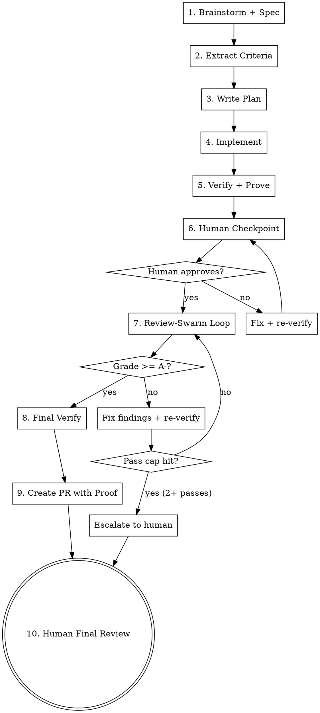

# Proof-Driven Development

Build a feature from idea to merge-ready PR with full proof of work.
Every requirement traced from spec to criteria to tests to verification
report to PR.

## Pipeline



## Phase 1: Brainstorm + Spec

**Invoke:** `superpowers:brainstorming`

Follow the full brainstorming flow — explore context, ask clarifying
questions one at a time, propose approaches, present design, write spec.

## Phase 2: Extract Criteria

**Invoke:** `criteria-extraction` skill

After the spec is approved, extract the criteria matrix. This produces
the testable contract for the rest of the pipeline.

Review the matrix output. If any requirement seems under-specified in
edge cases, re-dispatch the test architect with guidance on what to
probe deeper.

## Phase 3: Write Plan

**Invoke:** `superpowers:writing-plans`

Create the implementation plan. The plan must reference criteria matrix
IDs — each task should state which REQ/EC items it satisfies.

## Phase 4: Implement

**Invoke:** `superpowers:subagent-driven-development`

Execute the plan task-by-task. The criteria matrix is provided to the
spec reviewer so it checks against testable criteria, not just prose.

Create a feature branch before starting. Never commit to main/master.

## Phase 5: Verify + Prove

**Invoke:** `verify-and-prove` skill with mode `full`

This produces:
- Verification report (traceability matrix with pass/fail per requirement)
- Rerunnable verify script
- Visual artifacts (screenshots/GIFs)

If the report shows FAIL or UNCOVERED items, fix them before proceeding:
1. For FAIL: debug the failing test or implementation
2. For UNCOVERED: write the missing test
3. Re-run verify-and-prove in `rerun` mode
4. Repeat until status is PASS

## Phase 6: Human Checkpoint

Present the human with a guided review prompt using
`references/human-checkpoint-template.md`. Fill in all placeholders
from the verification report.

**Key principle:** The human should NOT re-check what tests already
verified. Focus them on:
- Items with proof type `manual`
- UX feel, copy quality, layout aesthetics
- UNCOVERED items that need a risk-acceptance decision
- Specific instructions on how to check (URLs, clicks, expected results)

**If the human has feedback:**
1. Capture feedback as concrete changes
2. Make the changes
3. Re-run verify-and-prove in `rerun` mode
4. Present a fresh checkpoint showing only what changed
5. Repeat until approved

## Phase 7: Review-Swarm Hardening Loop

Run review-swarm in an iteration loop targeting grade A-.

**Loop:**
1. Run `/review-swarm --no-gate`
2. Parse the grade from the report
3. If grade >= A-: exit loop, continue to Phase 8
4. If grade < A-:
   a. Fix findings in priority order: CRITICAL > HIGH > MEDIUM > LOW
   b. Re-run the verify script (catch regressions from fixes)
   c. If verify fails: fix the regression first
   d. Commit the fixes
   e. Go to step 1

**Pass cap:** After 2 full review-swarm passes with grade still below
A-, escalate to the human:

```
[proof-driven-dev] Review-swarm has run 2 passes. Current grade: {GRADE}
  Remaining findings:
  {FINDING_LIST}

  Options:
  1. Continue with another pass (diminishing returns likely)
  2. Accept current grade and proceed to PR
  3. Fix remaining issues manually

  What would you like to do?
```

## Phase 8: Final Verification

Re-run verify-and-prove in `rerun` mode. This is the "seal" — confirms
nothing broke during hardening.

- Recapture all visuals fresh
- If any requirement is FAIL: escalate to human, don't create the PR

## Phase 9: Create PR with Proof

1. Collect proof artifacts into the branch (verification report,
   screenshots, GIFs, criteria matrix)
2. Read the repo's PR template (`.github/PULL_REQUEST_TEMPLATE.md`
   or equivalent)
3. Fill in every section of the repo's template faithfully
4. Enhance with proof sections using `references/pr-proof-template.md`
5. Create the PR via `gh pr create`

## Phase 10: Human Final Review

Present the PR link. The human reviews, optionally runs
`./scripts/verify-<topic>.sh` for independent confirmation, and opens
for internal review when satisfied.

## Rules

- **Never skip criteria extraction.** It's the foundation of the proof
  trail. Without it, verification has nothing to verify against.
- **Never skip verification.** Even if all tests pass during
  implementation, the formal verification step produces the report and
  script that are the proof of work.
- **Never create the PR with known failures.** If verify-and-prove
  reports FAIL, fix it or escalate — don't ship known broken code.
- **Never skip the human checkpoint.** The human must see the feature
  and approve before hardening begins.
- **Never loop forever.** Both the human checkpoint and review-swarm
  loops have escape hatches. Use them.
- **Repo template first.** The PR uses the repo's own template,
  enhanced with proof — not a custom format.
- **Verify script is permanent.** It's committed to the repo and can
  be re-run by anyone at any time. It's the durable proof artifact.
