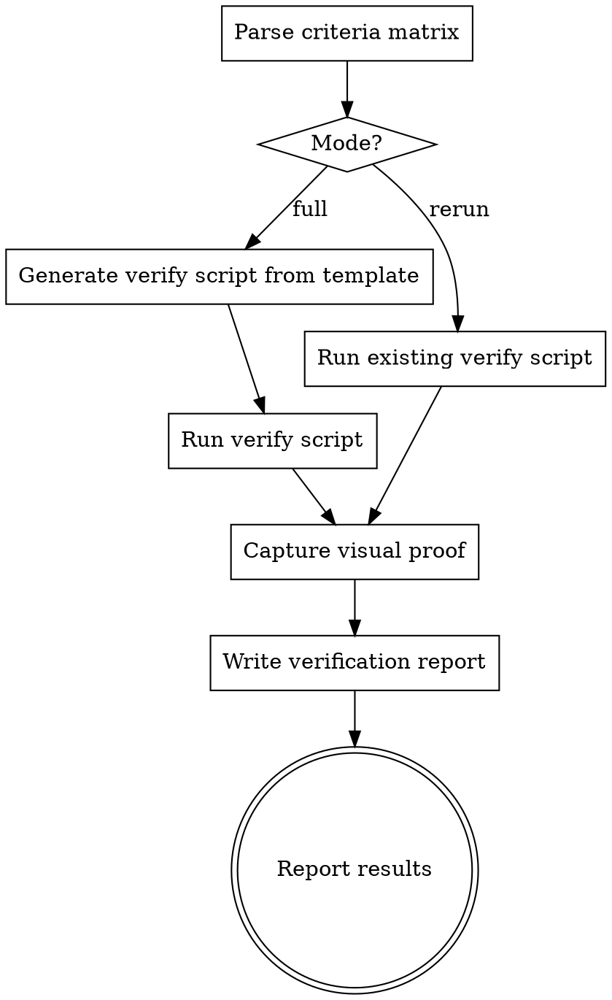

# Verify and Prove

Walk a criteria matrix requirement by requirement. For each: find the
test, run it, capture proof. Produce a verification report and a
rerunnable shell script.

## When to Use

- After implementation completes (before human checkpoint)
- After review-swarm hardening (before PR creation)
- After any change where you need to re-verify (simplify, refactor)
- Standalone on any project that has a criteria matrix

## Inputs

The caller provides:
1. **Criteria matrix path** — the `criteria-matrix.md` file
2. **Test command** — how to run the project's tests (e.g. `npm test`,
   `pytest`, `go test ./...`)
3. **Report directory** — where to write outputs (default:
   `docs/superpowers/verification/`)
4. **Mode** — `full` (first run: generate script + report + visuals) or
   `rerun` (re-execute existing script, recapture visuals)

## Process



### Full Mode

1. **Parse the criteria matrix.** Load all REQ and EC items with their
   proof types.

2. **Map requirements to tests.** For each item, find the test(s) that
   cover it. Search strategies (in order):
   - Test name contains the REQ/EC ID (e.g. `test_req_01_create_widget`)
   - Test name describes the same behavior (grep test files for keywords
     from the requirement description)
   - Test file covers the same module/function being tested
   - If no test found: mark as UNCOVERED

3. **Generate the verify script.** Read `references/verify-script-template.sh`.
   Fill in the placeholders:
   - `{{TOPIC}}` — feature name from the criteria matrix
   - `{{TOPIC_SLUG}}` — kebab-case version for filenames
   - `{{TIMESTAMP}}` — current UTC timestamp
   - `{{CRITERIA_PATH}}` — path to criteria matrix
   - `{{TEST_COMMAND}}` — project test command
   - `{{REPORT_DIR}}` — report output directory
   - `{{TEST_BLOCKS}}` — one block per requirement/edge case:

   For items with tests:
   ```bash
   header "REQ-01: User can create a widget"
   if $TEST_COMMAND --filter "test_req_01" 2>&1 | tail -5; then
       pass "REQ-01"
   else
       fail "REQ-01" "test failed"
   fi
   ```

   For items without tests:
   ```bash
   header "EC-01e: Submit while offline"
   skip "EC-01e: Submit while offline"
   ```

   Write the script to `scripts/verify-<topic-slug>.sh` and make it
   executable (`chmod +x`).

4. **Run the verify script.** Execute it and capture the output.

5. **Capture visual proof.** For each item with proof type `visual` or
   `visual-flow`, follow `references/visual-capture-guide.md`.

6. **Write the verification report.** Format:

   ```
   VERIFICATION_REPORT:
     spec: <spec path>
     criteria: <criteria matrix path>
     run_at: <timestamp>
     status: PASS | FAIL | PARTIAL

   RESULTS:
     - id: REQ-01 | status: PASS | tests: 3/3 | visual: screenshots/req-01-widget-created.png
     - id: EC-01a | status: PASS | tests: 1/1
     - id: EC-01b | status: FAIL | tests: 0/1 | note: <reason>

   UNCOVERED:
     - EC-01e: <description>

   SUMMARY:
     total: N | pass: N | fail: N | uncovered: N
     visual_artifacts: N screenshots, N gifs
   ```

   Write to `<report-dir>/YYYY-MM-DD-<topic>-report.md`.

### Rerun Mode

1. Check that `scripts/verify-<topic-slug>.sh` exists. If not, fall back
   to full mode.
2. Run the existing script. Capture output.
3. Recapture visual proof (code may have changed).
4. Overwrite the verification report with fresh results.

### Non-UI Projects

For projects without a browser/UI (pure backend, CLI tools, libraries):
- Proof types `visual` and `visual-flow` are skipped gracefully — the
  criteria matrix simply won't include them
- The criteria extraction step only assigns visual proof types when the
  spec describes user-facing UI
- The verify script and verification report work identically — they just
  won't have visual artifact sections

### Output

Print summary to the caller:

```
[verify-and-prove] Verification complete
  Status: PASS | FAIL | PARTIAL
  Results: N/N pass, N fail, N uncovered
  Report: <report path>
  Script: <script path>
  Visuals: N screenshots, N gifs
```

## Rules

- **Never fix anything.** Report only. The caller decides what to do
  about failures and uncovered items.
- **Never skip visual capture** for items that require it — unless
  browser tools are unavailable (then log a warning and mark as SKIPPED).
- **The verify script must be self-contained.** It should run from the
  project root with no dependencies beyond the project's own test setup.
  Anyone can execute `./scripts/verify-<topic>.sh` and get a pass/fail.
- **Rerun must be fast.** In rerun mode, don't regenerate the script —
  just execute and recapture visuals.
- **Exit codes matter.** The verify script exits 0 (all pass), 1 (failures),
  or 2 (uncovered but no failures). The skill uses these to determine
  the report status.
