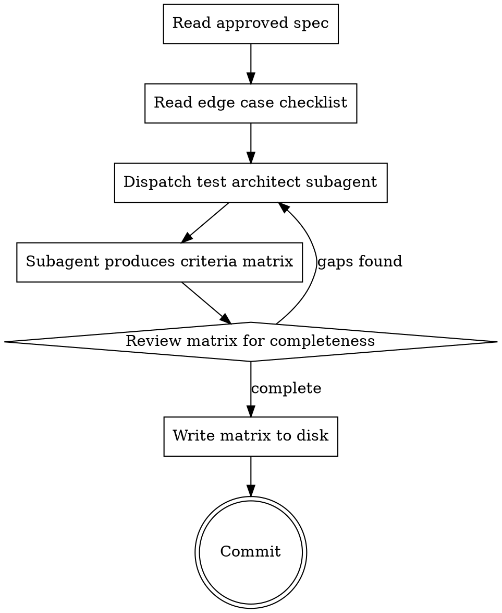
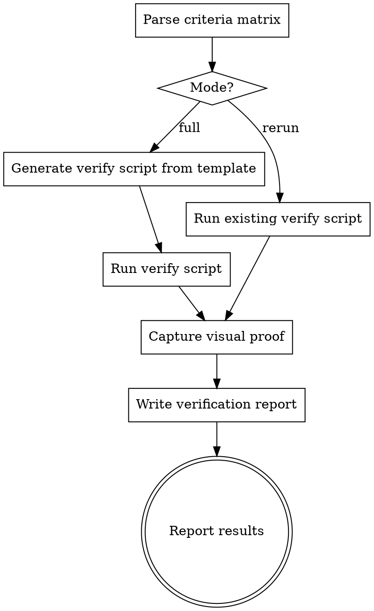
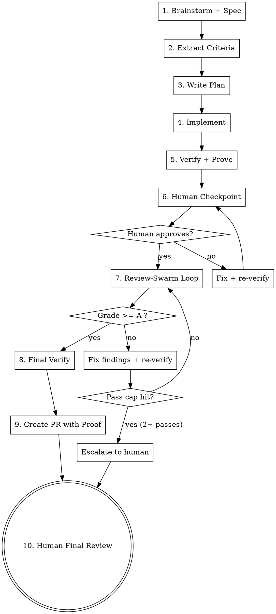

# Proof-Driven Development Pipeline — Implementation Plan

> **For agentic workers:** REQUIRED SUB-SKILL: Use superpowers:subagent-driven-development (recommended) or superpowers:executing-plans to implement this plan task-by-task. Steps use checkbox (`- [ ]`) syntax for tracking.

**Goal:** Build three new skills (criteria-extraction, verify-and-prove, proof-driven-dev orchestrator) that close gaps in testing coverage, spec conformance, proof-of-work, and rerunnability — plugging into the existing superpowers + review-swarm workflow.

**Architecture:** Bottom-up — build standalone skills first (criteria-extraction, verify-and-prove), then the orchestrator that composes them with existing skills (brainstorming, subagent-driven-dev, review-swarm). Each skill follows existing dotfiles conventions: `SKILL.md` frontmatter + markdown body, `references/` for supporting docs and templates.

**Tech Stack:** Claude Code skills (markdown), shell scripting (verify script template), existing superpowers plugin, review-swarm skill.

---

## File Structure

```
ai/skills/
  criteria-extraction/
    SKILL.md                              # Criteria extraction skill
    references/
      edge-case-checklist.md              # Systematic edge case categories
      test-architect-prompt.md            # Subagent prompt for the test architect

  verify-and-prove/
    SKILL.md                              # Verification skill
    references/
      verify-script-template.sh           # Template for rerunnable verify script
      visual-capture-guide.md             # Instructions for screenshot/GIF capture

  proof-driven-dev/
    SKILL.md                              # Orchestrator (full pipeline)
    references/
      human-checkpoint-template.md        # Template for guided human review prompt
      pr-proof-template.md                # Template for PR body enhancement with proof
```

---

### Task 1: Edge Case Checklist Reference

The foundational reference doc that the test architect subagent uses to systematically probe each requirement for edge cases. This must be thorough — it's the core mechanism for catching the edge cases Claude typically skips.

**Files:**
- Create: `ai/skills/criteria-extraction/references/edge-case-checklist.md`

- [ ] **Step 1: Create the checklist file**

```markdown
# Edge Case Checklist

Systematic categories to apply against EVERY requirement when extracting
acceptance criteria. For each requirement, walk through every applicable
category and generate specific edge cases.

## Input Validation
- Null / undefined / missing value
- Empty string / empty array / empty object
- Whitespace-only string
- Value at minimum boundary (0, 1, empty)
- Value at maximum boundary (max length, max count, max size)
- Value exceeding maximum (max + 1, over limit)
- Negative values where positive expected
- Wrong type (string where number expected, object where array expected)
- Malformed input (invalid email, partial URL, broken JSON)
- Unicode / special characters / emoji
- HTML/script injection strings
- Extremely long input (10x expected max)

## State & Lifecycle
- Operation on uninitialized / default state
- Operation during loading / pending state
- Operation after deletion / cleanup
- Rapid repeated operations (double-click, double-submit)
- Operation interrupted midway (tab close, navigation, disconnect)
- State after error recovery (retry after failure)
- Stale state (data changed since last fetch)
- Empty state (first use, no data yet)
- Full state (at capacity, all slots used)

## Concurrency & Timing
- Two users acting on the same resource simultaneously
- Request arrives after timeout
- Response arrives after component unmounted / page navigated
- Race between create and delete of same resource
- Optimistic update rolled back on server error
- Cache invalidation during concurrent writes

## Error & Failure
- Network timeout
- Network disconnect mid-operation
- Server returns 4xx (400, 401, 403, 404, 409, 422, 429)
- Server returns 5xx (500, 502, 503)
- Server returns unexpected shape (missing fields, extra fields)
- Partial success (batch where some items succeed, some fail)
- Cascading failure (dependency down)
- Disk full / quota exceeded
- Permission denied at OS or API level

## Authorization & Access
- Unauthenticated user attempting authenticated action
- User with insufficient permissions
- User accessing another user's resource
- Expired token / session
- Permission changed after page load but before action
- Admin vs. regular user behavior differences

## UI & Interaction (when applicable)
- Browser back/forward during operation
- Page refresh during operation
- Multiple tabs with same view
- Viewport: mobile, tablet, desktop
- Keyboard-only navigation
- Screen reader accessibility
- Slow network (3G simulation)
- Right-to-left text direction

## Data Boundary
- Exactly one item (not zero, not many)
- Maximum page size of paginated results
- Last page of paginated results (partial page)
- Filter/search with zero results
- Filter/search with one result
- Sort order with identical values (stable sort?)
- Data with all optional fields missing
- Data with all optional fields present
```

- [ ] **Step 2: Commit**

```bash
git add ai/skills/criteria-extraction/references/edge-case-checklist.md
git commit -m "Add edge case checklist for criteria extraction"
```

---

### Task 2: Test Architect Subagent Prompt

The prompt template dispatched by the criteria-extraction skill to produce the criteria matrix. This subagent reads the spec with fresh eyes and applies the edge case checklist systematically.

**Files:**
- Create: `ai/skills/criteria-extraction/references/test-architect-prompt.md`

- [ ] **Step 1: Create the prompt file**

```markdown
# Test Architect — Criteria Matrix Extraction

You are a Test Architect. Your job is to read a feature spec and produce
a machine-parseable criteria matrix that defines exactly what must be
tested, including every edge case.

You are deliberately separate from whoever wrote the spec — your purpose
is to find blind spots they missed.

## Inputs

You will receive:
1. The full spec document
2. The edge case checklist at references/edge-case-checklist.md

## Process

1. Read the spec end to end. Identify every distinct requirement — a
   behavior the system must exhibit. Number them REQ-01, REQ-02, etc.

2. For each requirement:
   a. State the happy path — the expected behavior when everything is normal.
   b. Determine proof type(s):
      - `test` — unit or integration test can verify this
      - `visual` — a screenshot proves the correct state (UI features only)
      - `visual-flow` — a GIF of an interaction flow proves it (UI features only)
      - `manual` — requires human judgment (UX feel, copy quality, layout aesthetics)
   c. Walk through EVERY category in the edge case checklist. For each
      category, ask: "Does this category apply to this requirement?" If yes,
      generate a specific, concrete edge case. ID them EC-{REQ}-{letter}
      (e.g. EC-01a, EC-01b).
   d. For each edge case, assign proof type(s).

3. Do NOT skip categories because they "probably don't apply." Check each
   one explicitly. It is better to generate an edge case that turns out to
   be inapplicable (the implementer can skip it) than to miss one that matters.

4. Do NOT invent requirements that aren't in the spec. Your job is to
   exhaustively test what the spec says, not to expand scope.

## Output Format

Produce the criteria matrix in this exact format:

```
CRITERIA_MATRIX:
  source_spec: {SPEC_PATH}
  generated_at: {TIMESTAMP}

REQUIREMENTS:
  - id: REQ-01
    description: <one-line summary>
    happy_path: <expected behavior under normal conditions>
    proof_type: [test, visual]
    edge_cases:
      - id: EC-01a
        description: <specific edge case>
        proof_type: [test]
      - id: EC-01b
        description: <specific edge case>
        proof_type: [test, visual]

  - id: REQ-02
    description: ...
    happy_path: ...
    proof_type: [test]
    edge_cases:
      - id: EC-02a
        description: ...
        proof_type: [test]

SUMMARY:
  total_requirements: <N>
  total_edge_cases: <N>
  proof_types:
    test_only: <N>
    visual: <N>
    visual_flow: <N>
    manual: <N>
```

## Quality Check

Before returning, verify:
- Every REQ has at least one edge case (if a requirement truly has none, state why)
- Every edge case has a proof type
- No duplicate edge cases across requirements
- Edge case descriptions are specific and concrete, not vague ("handles errors" is bad; "returns 422 with field-level error message when email is empty string" is good)
- The SUMMARY counts match the actual entries
```

- [ ] **Step 2: Commit**

```bash
git add ai/skills/criteria-extraction/references/test-architect-prompt.md
git commit -m "Add test architect subagent prompt for criteria extraction"
```

---

### Task 3: Criteria Extraction Skill

The skill that orchestrates criteria extraction — dispatches the test architect subagent with the spec and edge case checklist, and writes the criteria matrix to disk.

**Files:**
- Create: `ai/skills/criteria-extraction/SKILL.md`

- [ ] **Step 1: Create the skill file**

```markdown
---
name: criteria-extraction
description: Extract a testable criteria matrix from an approved spec. Use after superpowers:brainstorming writes the spec and before superpowers:writing-plans. Produces a structured matrix of requirements, edge cases, and proof types that the rest of the proof-driven pipeline verifies against.
---

# Criteria Extraction

Read an approved spec and produce a machine-parseable criteria matrix —
the testable contract that the implementation, verification, and review
phases all verify against.

## When to Use

After the spec is written and approved (via superpowers:brainstorming),
before writing the implementation plan. This is the bridge between
"what we're building" and "how we know it's built correctly."

## Process



### Step 1: Read inputs

1. Read the approved spec doc (path provided by caller or found in
   `docs/superpowers/specs/`)
2. Read `references/edge-case-checklist.md`

### Step 2: Dispatch test architect

Dispatch a subagent using the prompt template at
`references/test-architect-prompt.md`. Provide:
- The full spec content
- The full edge case checklist content
- The spec file path (for the `source_spec` field in output)

Use `model: "opus"` — criteria extraction requires adversarial thinking
and thoroughness, not speed.

### Step 3: Review the matrix

After the subagent returns, check:
- Every section/feature in the spec has at least one REQ entry
- Every REQ has at least one edge case
- Edge case descriptions are specific (not vague)
- SUMMARY counts match actual entries
- No proof types reference `visual` or `visual-flow` for non-UI features

If gaps exist, re-dispatch the subagent with specific instructions about
what was missed.

### Step 4: Write and commit

Write the criteria matrix to the same directory as the spec:
`<spec-dir>/YYYY-MM-DD-<topic>-criteria-matrix.md`

Commit with message: `Add criteria matrix for <topic>`

### Step 5: Report to caller

Print the summary:
```
[criteria-extraction] Matrix written to <path>
  Requirements: N
  Edge cases: N
  Proof types: N test-only, N visual, N visual-flow, N manual
```

## Rules

- **Never invent requirements.** The matrix tests what the spec says.
  Scope expansion belongs in the spec, not here.
- **Never skip the edge case checklist.** Every category must be
  evaluated against every requirement. Over-generation is acceptable;
  under-generation is not.
- **Fresh eyes only.** The test architect subagent must NOT receive
  the conversation history. It reads the spec cold, like an external
  QA engineer.
- **One matrix per spec.** If the spec covers multiple independent
  subsystems, it should have been split during brainstorming. If it
  wasn't, flag this and suggest splitting.
```

- [ ] **Step 2: Commit**

```bash
git add ai/skills/criteria-extraction/SKILL.md
git commit -m "Add criteria-extraction skill"
```

---

### Task 4: Verify Script Template

The shell script template that verify-and-prove uses to generate a project-specific, rerunnable verification script. This is actual executable code — the one artifact that survives the session and can be re-executed independently.

**Files:**
- Create: `ai/skills/verify-and-prove/references/verify-script-template.sh`

- [ ] **Step 1: Create the template file**

```bash
#!/usr/bin/env bash
# ============================================================================
# Verification Script: {{TOPIC}}
# Generated: {{TIMESTAMP}}
# Criteria matrix: {{CRITERIA_PATH}}
# Re-run after any change: ./scripts/verify-{{TOPIC_SLUG}}.sh
# ============================================================================
set -euo pipefail

SCRIPT_DIR="$(cd "$(dirname "${BASH_SOURCE[0]}")" && pwd)"
PROJECT_ROOT="$(cd "$SCRIPT_DIR/.." && pwd)"
cd "$PROJECT_ROOT"

# --- Configuration (filled at generation time) ---
TEST_COMMAND="{{TEST_COMMAND}}"
CRITERIA_PATH="{{CRITERIA_PATH}}"
REPORT_DIR="{{REPORT_DIR}}"
TOPIC_SLUG="{{TOPIC_SLUG}}"

# --- State ---
TOTAL=0
PASS=0
FAIL=0
UNCOVERED=0
ERRORS=()

# --- Helpers ---
header() { printf "\n\033[1;34m=== %s ===\033[0m\n" "$1"; }
pass()   { PASS=$((PASS + 1)); TOTAL=$((TOTAL + 1)); printf "  \033[32m✓\033[0m %s\n" "$1"; }
fail()   { FAIL=$((FAIL + 1)); TOTAL=$((TOTAL + 1)); ERRORS+=("FAIL: $1 — $2"); printf "  \033[31m✗\033[0m %s — %s\n" "$1" "$2"; }
skip()   { UNCOVERED=$((UNCOVERED + 1)); TOTAL=$((TOTAL + 1)); ERRORS+=("UNCOVERED: $1"); printf "  \033[33m?\033[0m %s (no test found)\n" "$1"; }

# --- Test runner ---
# Each block below corresponds to a requirement or edge case from the
# criteria matrix. The verify-and-prove skill fills these in at generation
# time based on the project's test structure.
#
# Pattern:
#   header "REQ-01: <description>"
#   if <test command succeeds>; then pass "REQ-01"; else fail "REQ-01" "<reason>"; fi
#
# For edge cases without tests:
#   skip "EC-01e: <description>"

{{TEST_BLOCKS}}

# --- Summary ---
header "Verification Summary"
echo "  Total:     $TOTAL"
echo "  Pass:      $PASS"
echo "  Fail:      $FAIL"
echo "  Uncovered: $UNCOVERED"
echo ""

if [ ${#ERRORS[@]} -gt 0 ]; then
    header "Issues"
    for e in "${ERRORS[@]}"; do
        echo "  - $e"
    done
fi

# Write machine-readable summary for CI/agent consumption
mkdir -p "$REPORT_DIR"
cat > "$REPORT_DIR/verify-summary-${TOPIC_SLUG}.txt" <<SUMMARY
status=$([ "$FAIL" -eq 0 ] && [ "$UNCOVERED" -eq 0 ] && echo "PASS" || ([ "$FAIL" -gt 0 ] && echo "FAIL" || echo "PARTIAL"))
total=$TOTAL
pass=$PASS
fail=$FAIL
uncovered=$UNCOVERED
SUMMARY

# Exit code: non-zero if any failures or uncovered items
if [ "$FAIL" -gt 0 ]; then
    echo ""
    echo "RESULT: FAIL ($FAIL failures)"
    exit 1
elif [ "$UNCOVERED" -gt 0 ]; then
    echo ""
    echo "RESULT: PARTIAL ($UNCOVERED uncovered requirements)"
    exit 2
else
    echo ""
    echo "RESULT: PASS (all $TOTAL requirements verified)"
    exit 0
fi
```

- [ ] **Step 2: Commit**

```bash
git add ai/skills/verify-and-prove/references/verify-script-template.sh
git commit -m "Add rerunnable verify script template"
```

---

### Task 5: Visual Capture Guide

Reference doc for the verify-and-prove skill explaining how to capture screenshots and GIFs for visual proof.

**Files:**
- Create: `ai/skills/verify-and-prove/references/visual-capture-guide.md`

- [ ] **Step 1: Create the guide file**

```markdown
# Visual Capture Guide

Instructions for capturing visual proof artifacts during verification.

## When to Capture

Only capture visuals for criteria items with proof type `visual` or
`visual-flow`. Skip for `test`-only items and for non-UI projects.

## Screenshots (proof type: visual)

Use the browser tools (Claude in Chrome or equivalent) to capture
screenshots of specific UI states.

**Process:**
1. Navigate to the relevant page/view
2. Set up the required state (create data, trigger conditions)
3. Take a screenshot using `computer` tool with `action: screenshot`
   and `save_to_disk: true`
4. Name the file: `{REQ_ID}-{short-description}.png`
   (e.g. `req-01-widget-created.png`)
5. Store in the report's screenshots directory

**What to capture:**
- The final state that proves the requirement is satisfied
- Include enough surrounding context to show where the element is
- For error states: capture the error message/UI

## GIF Recordings (proof type: visual-flow)

Use the `gif_creator` tool to record interaction flows.

**Process:**
1. Start recording: `gif_creator` with `action: start_recording`
2. Take an initial screenshot (first frame)
3. Perform the interaction (clicks, typing, navigation)
4. Take a final screenshot (last frame)
5. Stop recording: `gif_creator` with `action: stop_recording`
6. Export: `gif_creator` with `action: export`, `download: true`
7. Name the file: `{REQ_ID}-{short-description}.gif`
   (e.g. `req-02-pagination-flow.gif`)

**What to record:**
- The full happy path or edge case interaction
- Keep it focused — 5-15 seconds max
- Ensure each click/action is visible

## Graceful Degradation

If browser tools are not available (headless environment, no Chrome
extension):
- Log a warning: `[verify-and-prove] Visual capture unavailable — skipping visual proofs`
- Mark visual items in the report as: `visual: SKIPPED (no browser tools)`
- Do NOT fail the verification — visual proof is additive, not blocking

## Storage

Visual artifacts are stored alongside the verification report:
```
docs/superpowers/verification/
  YYYY-MM-DD-<topic>-report.md
  screenshots/
    req-01-widget-created.png
    req-02-pagination-flow.gif
    ...
```
```

- [ ] **Step 2: Commit**

```bash
git add ai/skills/verify-and-prove/references/visual-capture-guide.md
git commit -m "Add visual capture guide for verify-and-prove"
```

---

### Task 6: Verify-and-Prove Skill

The core verification skill that walks the criteria matrix, runs tests, captures visuals, and produces the verification report + rerunnable script.

**Files:**
- Create: `ai/skills/verify-and-prove/SKILL.md`

- [ ] **Step 1: Create the skill file**

```markdown
---
name: verify-and-prove
description: Walk a criteria matrix line by line, run tests, capture visual proof, and produce a verification report + rerunnable script. Use after implementation completes and again after review-swarm hardening. Rerunnable — the generated verify script can be re-executed after any change (simplify, refactor, etc.).
---

# Verify and Prove

Walk a criteria matrix requirement by requirement. For each: find the
test, run it, capture proof. Produce a verification report and a
rerunnable shell script.

## When to Use

- After implementation completes (Phase 3 in proof-driven-dev)
- After review-swarm hardening (Phase 6 in proof-driven-dev)
- After any change where you need to re-verify (simplify, refactor)
- Standalone on any project that has a criteria matrix

## Inputs

The caller provides:
1. **Criteria matrix path** — the `criteria-matrix.md` file
2. **Test command** — how to run the project's tests (e.g. `npm test`,
   `pytest`, `go test ./...`)
3. **Report directory** — where to write outputs (default:
   `docs/superpowers/verification/`)
4. **Mode** — `full` (first run: generate script + report + visuals) or
   `rerun` (re-execute existing script, recapture visuals)

## Process



### Full Mode

1. **Parse the criteria matrix.** Load all REQ and EC items with their
   proof types.

2. **Map requirements to tests.** For each item, find the test(s) that
   cover it. Search strategies (in order):
   - Test name contains the REQ/EC ID (e.g. `test_req_01_create_widget`)
   - Test name describes the same behavior (grep test files for keywords
     from the requirement description)
   - Test file covers the same module/function being tested
   - If no test found: mark as UNCOVERED

3. **Generate the verify script.** Read `references/verify-script-template.sh`.
   Fill in the placeholders:
   - `{{TOPIC}}` — feature name from the criteria matrix
   - `{{TOPIC_SLUG}}` — kebab-case version for filenames
   - `{{TIMESTAMP}}` — current UTC timestamp
   - `{{CRITERIA_PATH}}` — path to criteria matrix
   - `{{TEST_COMMAND}}` — project test command
   - `{{REPORT_DIR}}` — report output directory
   - `{{TEST_BLOCKS}}` — one block per requirement/edge case:

   For items with tests:
   ```bash
   header "REQ-01: User can create a widget"
   if $TEST_COMMAND --filter "test_req_01" 2>&1 | tail -5; then
       pass "REQ-01"
   else
       fail "REQ-01" "test failed"
   fi
   ```

   For items without tests:
   ```bash
   header "EC-01e: Submit while offline"
   skip "EC-01e: Submit while offline"
   ```

   Write the script to `scripts/verify-<topic-slug>.sh` and make it
   executable (`chmod +x`).

4. **Run the verify script.** Execute it and capture the output.

5. **Capture visual proof.** For each item with proof type `visual` or
   `visual-flow`, follow `references/visual-capture-guide.md`.

6. **Write the verification report.** Format:

   ```
   VERIFICATION_REPORT:
     spec: <spec path>
     criteria: <criteria matrix path>
     run_at: <timestamp>
     status: PASS | FAIL | PARTIAL

   RESULTS:
     - id: REQ-01 | status: PASS | tests: 3/3 | visual: screenshots/req-01-widget-created.png
     - id: EC-01a | status: PASS | tests: 1/1
     - id: EC-01b | status: FAIL | tests: 0/1 | note: <reason>

   UNCOVERED:
     - EC-01e: <description>

   SUMMARY:
     total: N | pass: N | fail: N | uncovered: N
     visual_artifacts: N screenshots, N gifs
   ```

   Write to `<report-dir>/YYYY-MM-DD-<topic>-report.md`.

### Rerun Mode

1. Check that `scripts/verify-<topic-slug>.sh` exists. If not, fall back
   to full mode.
2. Run the existing script. Capture output.
3. Recapture visual proof (code may have changed).
4. Overwrite the verification report with fresh results.

### Output

Print summary to the caller:

```
[verify-and-prove] Verification complete
  Status: PASS | FAIL | PARTIAL
  Results: N/N pass, N fail, N uncovered
  Report: <report path>
  Script: <script path>
  Visuals: N screenshots, N gifs
```

## Rules

- **Never fix anything.** Report only. The caller decides what to do
  about failures and uncovered items.
- **Never skip visual capture** for items that require it — unless
  browser tools are unavailable (then log a warning and mark as SKIPPED).
- **The verify script must be self-contained.** It should run from the
  project root with no dependencies beyond the project's own test setup.
  Anyone can execute `./scripts/verify-<topic>.sh` and get a pass/fail.
- **Rerun must be fast.** In rerun mode, don't regenerate the script —
  just execute and recapture visuals.
- **Exit codes matter.** The verify script exits 0 (all pass), 1 (failures),
  or 2 (uncovered but no failures). The skill uses these to determine
  the report status.
```

- [ ] **Step 2: Commit**

```bash
git add ai/skills/verify-and-prove/SKILL.md
git commit -m "Add verify-and-prove skill"
```

---

### Task 7: Human Checkpoint Template

The template used by the orchestrator to present a structured review prompt to the human.

**Files:**
- Create: `ai/skills/proof-driven-dev/references/human-checkpoint-template.md`

- [ ] **Step 1: Create the template file**

```markdown
# Human Checkpoint Template

Template for presenting verification results to the human for review.
The orchestrator fills in the placeholders and presents this as a
structured message.

---

## What Was Built

{FEATURE_SUMMARY}

## Verification Status

{VERIFICATION_SUMMARY}

- **Pass:** {PASS_COUNT}/{TOTAL_COUNT} requirements verified
- **Fail:** {FAIL_COUNT} (details below if any)
- **Uncovered:** {UNCOVERED_COUNT} (details below if any)

{IF_FAILURES}
### Failures
{FAILURE_LIST}
{END_IF}

{IF_UNCOVERED}
### Uncovered Requirements
These have no automated test. Decide whether to add a test or accept
the risk:
{UNCOVERED_LIST}
{END_IF}

## Visual Evidence

{VISUAL_LIST}

(Screenshots and GIFs of the feature in action — review these to
confirm the feature looks and feels right.)

## What to Check

These items need your judgment — automated tests can't evaluate them:

{MANUAL_CHECK_LIST}

### How to Check

{CHECK_INSTRUCTIONS}

(Step-by-step: which URL, what to click, what to look for.)

---

**Next steps:**
- If everything looks good → say "approved" and the pipeline continues
  to production hardening (review-swarm).
- If changes are needed → describe what to fix. The pipeline will
  make changes, re-verify, and present a fresh checkpoint showing
  only what changed.
```

- [ ] **Step 2: Commit**

```bash
git add ai/skills/proof-driven-dev/references/human-checkpoint-template.md
git commit -m "Add human checkpoint template"
```

---

### Task 8: PR Proof Template

The template for enhancing the repo's PR template with proof artifacts.

**Files:**
- Create: `ai/skills/proof-driven-dev/references/pr-proof-template.md`

- [ ] **Step 1: Create the template file**

```markdown
# PR Proof Enhancement Template

After filling in the repo's own PR template (`.github/PULL_REQUEST_TEMPLATE.md`
or equivalent), append or integrate the following proof sections.

Do NOT replace the repo's template — fill it in faithfully, then enhance
with these additions where they fit naturally.

---

## Proof Sections to Integrate

### Verification Summary

Insert into the appropriate section of the repo's template (usually
"Testing" or "How to test"):

```
**Automated Verification:**
- Criteria matrix: {TOTAL_REQUIREMENTS} requirements, {TOTAL_EDGE_CASES} edge cases
- Verification result: {PASS_COUNT}/{TOTAL_COUNT} pass, {FAIL_COUNT} fail, {UNCOVERED_COUNT} uncovered
- Review-swarm grade: {REVIEW_SWARM_GRADE}
- Rerunnable verify script: `./scripts/verify-{TOPIC_SLUG}.sh`
```

### Visual Proof

Insert screenshots and GIFs inline in the PR body. GitHub renders these
directly — reviewers see the feature without leaving the PR page.

For each visual artifact:
```
### {REQ_ID}: {DESCRIPTION}

```

Group by feature area. Put the most important flows first.

### How to Review

Insert a section guiding reviewers on what to focus on:

```
**What automated tests cover:**
- {list of what's verified — reviewers don't need to manually check these}

**What needs human review:**
- {list of items requiring judgment — UX feel, copy, layout, etc.}

**To independently verify:**
1. Check out this branch
2. Run `./scripts/verify-{TOPIC_SLUG}.sh`
3. All checks should pass with exit code 0
```

## Rules

- **Repo template first.** Always start from the repo's existing PR
  template. These proof sections enhance it, not replace it.
- **Images in the branch.** Visual artifacts must be committed to the
  branch so the relative paths resolve in the PR. Don't use absolute
  paths or external hosting.
- **Keep it scannable.** Reviewers skim PR descriptions. Use headers,
  bullet lists, and inline images — not walls of text.
- **No internal metrics.** Don't include test execution times, token
  counts, or internal operational details.
```

- [ ] **Step 2: Commit**

```bash
git add ai/skills/proof-driven-dev/references/pr-proof-template.md
git commit -m "Add PR proof enhancement template"
```

---

### Task 9: Proof-Driven-Dev Orchestrator Skill

The main skill that ties the entire pipeline together — from brainstorming through PR creation. This is the evolution of hey-bud with proof-driven verification built in.

**Files:**
- Create: `ai/skills/proof-driven-dev/SKILL.md`

- [ ] **Step 1: Create the skill file**

```markdown
---
name: proof-driven-dev
description: End-to-end proof-driven development pipeline. Brainstorm → extract criteria → implement → verify with proof → human checkpoint → review-swarm hardening loop (until A-) → final verify → PR with proof. Use when starting any feature from scratch and you want full traceability from spec to proof of work.
---

# Proof-Driven Development

Build a feature from idea to merge-ready PR with full proof of work.
Every requirement traced from spec → criteria → tests → verification
report → PR.

## Pipeline



## Phase 1: Brainstorm + Spec

**Invoke:** `superpowers:brainstorming`

Follow the full brainstorming flow — explore context, ask clarifying
questions one at a time, propose approaches, present design, write spec.

## Phase 2: Extract Criteria

**Invoke:** `criteria-extraction` skill

After the spec is approved, extract the criteria matrix. This produces
the testable contract for the rest of the pipeline.

Review the matrix output. If any requirement seems under-specified in
edge cases, re-dispatch the test architect with guidance on what to
probe deeper.

## Phase 3: Write Plan

**Invoke:** `superpowers:writing-plans`

Create the implementation plan. The plan must reference criteria matrix
IDs — each task should state which REQ/EC items it satisfies.

## Phase 4: Implement

**Invoke:** `superpowers:subagent-driven-development`

Execute the plan task-by-task. The criteria matrix is provided to the
spec reviewer so it checks against testable criteria, not just prose.

Create a feature branch before starting. Never commit to main/master.

## Phase 5: Verify + Prove

**Invoke:** `verify-and-prove` skill with mode `full`

This produces:
- Verification report (traceability matrix with pass/fail per requirement)
- Rerunnable verify script
- Visual artifacts (screenshots/GIFs)

If the report shows FAIL or UNCOVERED items, fix them before proceeding:
1. For FAIL: debug the failing test or implementation
2. For UNCOVERED: write the missing test
3. Re-run verify-and-prove in `rerun` mode
4. Repeat until status is PASS

## Phase 6: Human Checkpoint

Present the human with a guided review prompt using
`references/human-checkpoint-template.md`. Fill in all placeholders
from the verification report.

**Key principle:** The human should NOT re-check what tests already
verified. Focus them on:
- Items with proof type `manual`
- UX feel, copy quality, layout aesthetics
- UNCOVERED items that need a risk-acceptance decision
- Specific instructions on how to check (URLs, clicks, expected results)

**If the human has feedback:**
1. Capture feedback as concrete changes
2. Make the changes
3. Re-run verify-and-prove in `rerun` mode
4. Present a fresh checkpoint showing only what changed
5. Repeat until approved

## Phase 7: Review-Swarm Hardening Loop

Run review-swarm in an iteration loop targeting grade A-.

**Loop:**
1. Run `/review-swarm --no-gate`
2. Parse the grade from the report
3. If grade >= A-: exit loop, continue to Phase 8
4. If grade < A-:
   a. Fix findings in priority order: CRITICAL → HIGH → MEDIUM → LOW
   b. Re-run the verify script (catch regressions from fixes)
   c. If verify fails: fix the regression first
   d. Commit the fixes
   e. Go to step 1

**Pass cap:** After 2 full review-swarm passes with grade still below
A-, escalate to the human:

```
[proof-driven-dev] Review-swarm has run 2 passes. Current grade: {GRADE}
  Remaining findings:
  {FINDING_LIST}

  Options:
  1. Continue with another pass (diminishing returns likely)
  2. Accept current grade and proceed to PR
  3. Fix remaining issues manually

  What would you like to do?
```

## Phase 8: Final Verification

Re-run verify-and-prove in `rerun` mode. This is the "seal" — confirms
nothing broke during hardening.

- Recapture all visuals fresh
- If any requirement is FAIL: escalate to human, don't create the PR

## Phase 9: Create PR with Proof

1. Collect proof artifacts into the branch (verification report,
   screenshots, GIFs, criteria matrix)
2. Read the repo's PR template (`.github/PULL_REQUEST_TEMPLATE.md`
   or equivalent)
3. Fill in every section of the repo's template faithfully
4. Enhance with proof sections using `references/pr-proof-template.md`
5. Create the PR via `gh pr create`

## Phase 10: Human Final Review

Present the PR link. The human reviews, optionally runs
`./scripts/verify-<topic>.sh` for independent confirmation, and opens
for internal review when satisfied.

## Rules

- **Never skip criteria extraction.** It's the foundation of the proof
  trail. Without it, verification has nothing to verify against.
- **Never skip verification.** Even if all tests pass during
  implementation, the formal verification step produces the report and
  script that are the proof of work.
- **Never create the PR with known failures.** If verify-and-prove
  reports FAIL, fix it or escalate — don't ship known broken code.
- **Never skip the human checkpoint.** The human must see the feature
  and approve before hardening begins.
- **Never loop forever.** Both the human checkpoint and review-swarm
  loops have escape hatches. Use them.
- **Repo template first.** The PR uses the repo's own template,
  enhanced with proof — not a custom format.
- **Verify script is permanent.** It's committed to the repo and can
  be re-run by anyone at any time. It's the durable proof artifact.
```

- [ ] **Step 2: Commit**

```bash
git add ai/skills/proof-driven-dev/SKILL.md
git commit -m "Add proof-driven-dev orchestrator skill"
```

---

### Task 10: Final Review + Push

Review all files as a whole, ensure cross-references are correct, and push.

**Files:**
- All files created in Tasks 1-9

- [ ] **Step 1: Verify all files exist and cross-references resolve**

```bash
# Check all expected files exist
ls -la ai/skills/criteria-extraction/SKILL.md
ls -la ai/skills/criteria-extraction/references/edge-case-checklist.md
ls -la ai/skills/criteria-extraction/references/test-architect-prompt.md
ls -la ai/skills/verify-and-prove/SKILL.md
ls -la ai/skills/verify-and-prove/references/verify-script-template.sh
ls -la ai/skills/verify-and-prove/references/visual-capture-guide.md
ls -la ai/skills/proof-driven-dev/SKILL.md
ls -la ai/skills/proof-driven-dev/references/human-checkpoint-template.md
ls -la ai/skills/proof-driven-dev/references/pr-proof-template.md
```

- [ ] **Step 2: Verify cross-references**

Check that every `references/` path mentioned in a SKILL.md actually
exists:
- `criteria-extraction/SKILL.md` references:
  - `references/edge-case-checklist.md` ✓
  - `references/test-architect-prompt.md` ✓
- `verify-and-prove/SKILL.md` references:
  - `references/verify-script-template.sh` ✓
  - `references/visual-capture-guide.md` ✓
- `proof-driven-dev/SKILL.md` references:
  - `references/human-checkpoint-template.md` ✓
  - `references/pr-proof-template.md` ✓
  - `criteria-extraction` skill ✓
  - `verify-and-prove` skill ✓
  - `superpowers:brainstorming` (external) ✓
  - `superpowers:writing-plans` (external) ✓
  - `superpowers:subagent-driven-development` (external) ✓
  - `review-swarm` skill ✓

- [ ] **Step 3: Push to remote**

```bash
git push origin main
```
